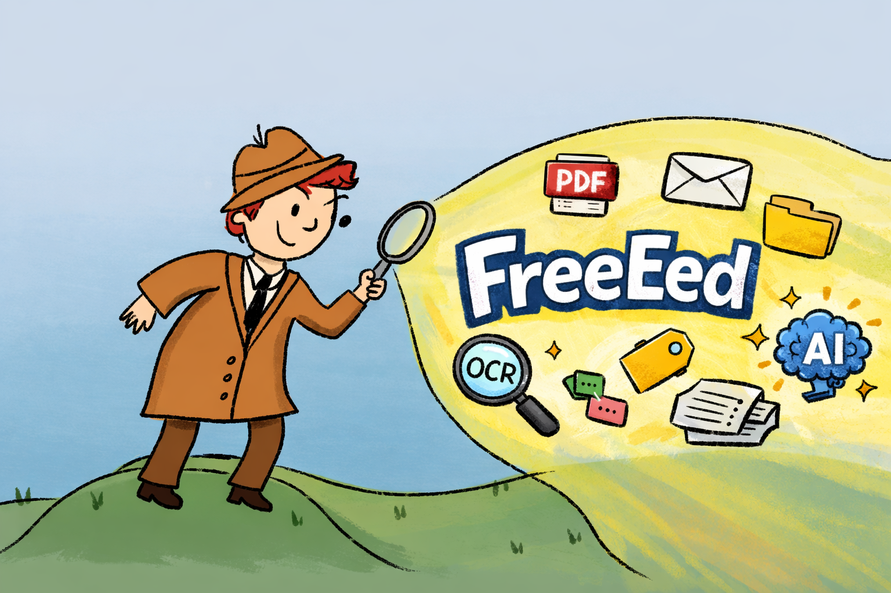

  

# FreeEed

FreeEed is an open-source eDiscovery platform to **ingest, process, OCR, and review** large document collections — with optional AI assistance for investigation and analysis.

- Website: https://freeeed.org
- Support: https://freeeed.org/support/
- Docs (Wiki): https://github.com/shmsoft/FreeEed/wiki

---

## Download

### Fastest option (recommended for teams)
- [Buy support](https://freeeed.org/support/) and request a ready-to-run VM

### Latest stable release
- Complete Pack (stable): https://shmsoft.s3.amazonaws.com/releases/freeeed_complete_pack-10.8.0.zip

### Nightly builds (unstable)
Nightly builds are produced automatically and may be broken.

- Complete Pack (nightly): https://shmsoft.s3.amazonaws.com/releases/freeeed_complete_pack-10.8.1-SNAPSHOT.zip
- Windows Installer (nightly): https://shmsoft.s3.us-east-1.amazonaws.com/releases/FreeEed-10.8.1-SNAPSHOT-Windows.exe
- Linux Installer (nightly): https://shmsoft.s3.us-east-1.amazonaws.com/releases/FreeEed-10.8.1-SNAPSHOT-Linux.run

---

## Quick start

1. Follow the installation guide: https://github.com/shmsoft/FreeEed/wiki/FreeEed-Installation
2. **Complete Pack unzip key (if needed):** email mark@scaia.ai and tell us a little about your use case.

---

## Capabilities

- Runs on Windows, macOS, Linux, VirtualBox, and AWS
- Processes 1,400+ file types including MS Office and PST (via Apache Tika): https://tika.apache.org/
- OCR
- AI-assisted investigation (“talk to your eDiscovery documents”)
- AI analysis (responsive, privileged, “smoking gun”) — under development
- Video and audio transcription
- Document review
- “Imaging” (conversion of documents to PDF)

---

## How it works

At a high level:

