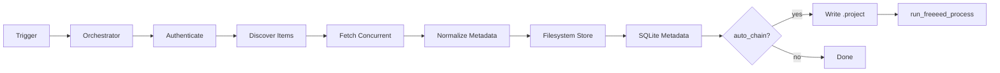

# Ingestion Flow

## Pipeline Stages



## Idempotency

Items are skipped when the same `item_id` + `checksum` already exists in the job metadata store. Writes use temp files + atomic rename.

## Concurrency

`StreamingEngine` fetches with a thread pool (default 4 workers). Rate-limit responses trigger backoff via `Retry-After`.

## Metadata Normalization

`MetadataNormalizer` produces canonical `ItemMetadata`:

- Sanitized filenames
- SHA-256 content checksums
- Connector ID in `extra.connector_id`

## Output Layout

```
/data/input/collections/<job_id>/
  doc1.pdf
  doc2.txt
  metadata.db
```

## Processing Chain

When enabled, `ProcessingEngineClient` writes keys matching Java expectations:

```
input=/data/input/collections/<job_id>
output-dir=/data/output
custodian=collector
stage=true
solr_endpoint=http://solr:8983
processing_engine=Standard
```

Note: uses `input=` (not `input-dir`) per FreeEed canonical format.
