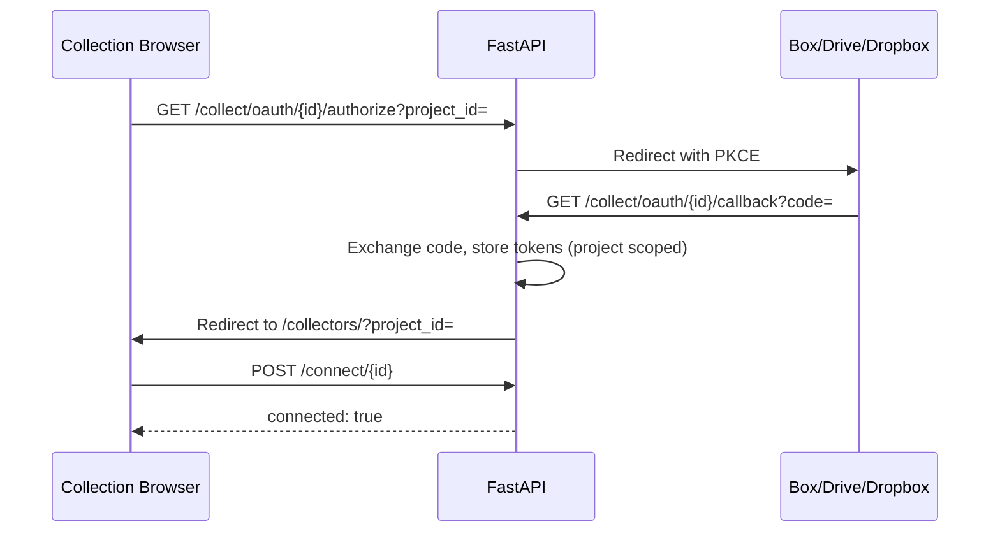

# M9 — Collection Selection UI (Design Spec)

Interactive, case-scoped UI for browsing external sources (Box, Google Drive, Dropbox), selecting folders/files, and triggering collection jobs. Builds on the browse/select REST API documented in [`browse-and-select.md`](browse-and-select.md).

## Goals

- Let reviewers pick evidence from cloud connectors **in the context of a FreeEed case** (`project_id` = `.project` `project-code`).
- Support OAuth without leaving the workflow (embedded browser / WebView).
- Lazy-load large folder trees; multi-select folders and files with clear validation before collection.
- Surface collection job status after trigger.

## UI options

| Option | Path | Recommendation |
|--------|------|----------------|
| **Web UI** | `api/static/collectors/` → `/collectors/` via FastAPI `StaticFiles` | **Default** — faster tree UX, OAuth redirects, single Docker image |
| **Swing panel** | `freeeed-processing/src/main/java/org/freeeed/ui/` | Alternative for desktop-only installs; same REST API |

This milestone implements the **web UI** first unless a desktop-only constraint is explicit.

## Screens

### 1. Case context bar

- Displays `project_id`, `project_name`, `custodian` (from active `.project` or query params).
- Connector tabs: Box | Google Drive | Dropbox.
- Connection badge: connected / not connected / OAuth required.

### 2. OAuth gate

When `POST /collect/projects/{project_id}/connect/{connector_id}` returns `503` or `401`:

- Show **Connect** button → opens `/collect/oauth/{connector_id}/authorize?project_id={project_id}&redirect_after=/collectors/?project_id={project_id}` in same window or popup.
- On callback success, return to browser with tokens stored server-side.

### 3. Browse tree

- **Breadcrumbs** from root to current `parent_id`.
- **Lazy children**: `GET /collect/projects/{project_id}/browse/{connector_id}?parent_id=...`
- Folder click → navigate; checkbox → add/remove from selection set.
- File rows: name, size, modified date, type icon.

Root parent IDs: `box` → `0`; `google_drive` → `root`; `dropbox` → `""` (path-based).

### 4. Selection panel

- List of checked items (id, name, path, type).
- **Save selections** → `POST /collect/projects/{project_id}/selections`
- **Load saved** → `GET /collect/projects/{project_id}/selections?connector_id=...`
- Validation: at least one item; warn on empty folders-only if policy requires files.

### 5. Collect & status

- **Custodian** field (pre-filled from `.project`).
- **Auto-chain** toggle (default from case settings).
- **Start collection** → `POST /collect/projects/{project_id}/trigger` with `processing.project_code`, `project_name`, `custodian`.
- Poll `GET /collect/jobs/{job_id}` until terminal state; show manifest summary.

## API mapping

| UI action | Endpoint |
|-----------|----------|
| List connectors | `GET /collect/connectors` |
| Connect / verify auth | `POST /collect/projects/{project_id}/connect/{connector_id}` |
| Start OAuth | `GET /collect/oauth/{connector_id}/authorize?project_id=...` |
| List folder children | `GET /collect/projects/{project_id}/browse/{connector_id}?parent_id=...` |
| Save picks | `POST /collect/projects/{project_id}/selections` |
| Load picks | `GET /collect/projects/{project_id}/selections?connector_id=...` |
| Trigger job | `POST /collect/projects/{project_id}/trigger` |
| Job status | `GET /collect/jobs/{job_id}` |

## OAuth flow (web)

## Component breakdown (web)

| Component | Responsibility |
|-----------|----------------|
| `CaseContext` | project_id, custodian, connector tab state |
| `ConnectorStatus` | connect/OAuth CTA, health badge |
| `BreadcrumbNav` | path stack, navigate to ancestor |
| `FolderTree` | lazy fetch, expand/collapse, loading/error states |
| `SelectionList` | checked items, save/load API |
| `CollectDialog` | custodian, auto_chain, trigger + poll job |
| `api.js` | thin fetch wrapper for `/collect/*` |

Vanilla JS for v1 (`api/static/collectors/index.html`); consider a small framework only if complexity warrants it.

## Implementation status (v1)

| Feature | Status | Notes |
|---------|--------|-------|
| Project context (`project_id`, custodian) | **Done** | Default `1`; `?project_id=` query param; Apply updates URL |
| Connector tabs (dropbox, box, google_drive) | **Done** | Tab switch resets browse root and checks connection |
| OAuth gate (401/503 → Connect) | **Done** | Links to `/collect/oauth/{id}/authorize?project_id=&redirect_after=/collectors/` |
| Lazy folder browser + breadcrumbs | **Done** | `GET .../browse/...?parent_id=`; folder row click drills down |
| Multi-select (checkboxes, Select folder) | **Done** | In-memory selection panel with remove/clear |
| Save selections | **Done** | `POST .../selections` |
| Load saved selections | **Done** | `GET .../selections?connector_id=` |
| Trigger collection | **Done** | `POST .../trigger`; `auto_chain` off by default |
| Job status polling | **Done** | Polls `GET /collect/jobs/{job_id}` every 2s until terminal |
| Loading / error states | **Done** | Connection badge, browse spinner, message banner |

**Open for later:** project name from `.project` file, empty-folder-only validation, mobile polish, real-time sync badges.

## Static mount

FastAPI serves assets from `api/static/collectors/` at `/collectors/` (see `api/main.py`). Open **`http://localhost:8000/collectors/`** (or your API base URL) when the API is running.

## Swing alternative (documented, not M9 default)

1. Read `project-code` from active `.project`.
2. Use `HttpClient` against the same endpoints (base URL from config, default `http://localhost:8000`).
3. OAuth: open system browser or `JEditorPane` / JavaFX `WebView` for authorize URL.
4. `JTree` + lazy `TreeExpansionListener` calling browse API per node.

## Out of scope (M9 v1)

- Real-time sync / delta badges on tree nodes
- Bulk rename or cloud-side operations
- Mobile-responsive polish beyond functional layout

## Related docs

- [`browse-and-select.md`](browse-and-select.md) — REST contract
- [`architecture.md`](architecture.md) — collector subsystem overview
- [`docs/collector-framework/traceability.md`](../../../docs/collector-framework/traceability.md) — M9 milestone tracking
