# FreeEed Demo

In this lab we will practice install and operations of FreeEed Search Application.


Lab Goals:


### STEP 1: Login to the server

Each student is provided their individual server and credentials

(Instructor: use our ubuntu AMI, t2.large or t2.xlarge instances and Elasticsearch security group)


First make sure Java 8 is installed:

```bash
java -version
```


If you have not done so already, add the following:

```bash
ssh ubuntu@your-server-ip
```
* Provide your password

```bash
wget https://shmsoft.s3.amazonaws.com/releases/freeeed_complete_pack-9.3.6.zip
unzip freeeed_complete_pack-9.3.6.zip
```

* You will be asked for the password to unzip the file. It is `4ushScaiaH7XZT1`.

```bash
wget -O- https://apt.corretto.aws/corretto.key | sudo apt-key add - 
sudo add-apt-repository 'deb https://apt.corretto.aws stable main'
sudo apt-get update; sudo apt-get install -y java-11-amazon-corretto-jdk
```

* Stuff needed by the app

```bash
sudo apt install pst-utils -y
```

### STEP 2: Continue in the VM user Desktop interface.

* Open a terminal

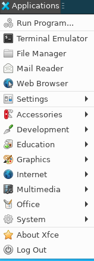


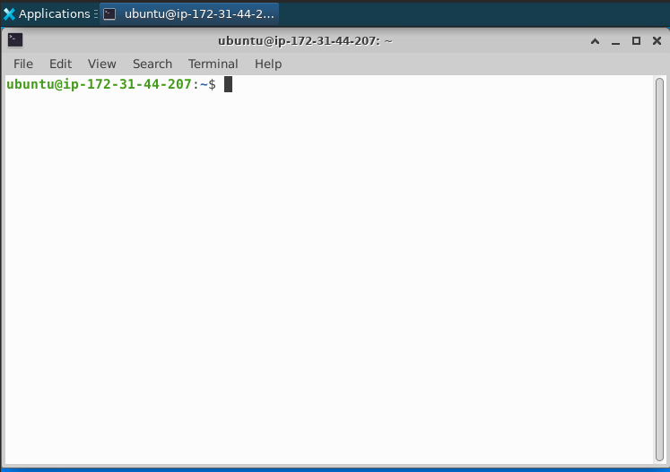

* In this terminal, type:

```bash
cd freeeed_complete_pack/
./start_all.sh
```

* Continue in the VM user Desktop interface.
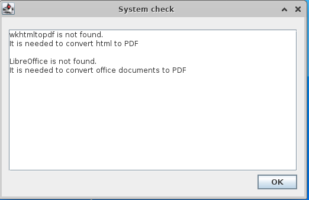

* Click "OK" to close the dialog.

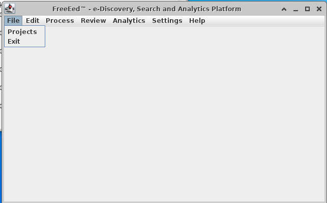

* Open File-Projects
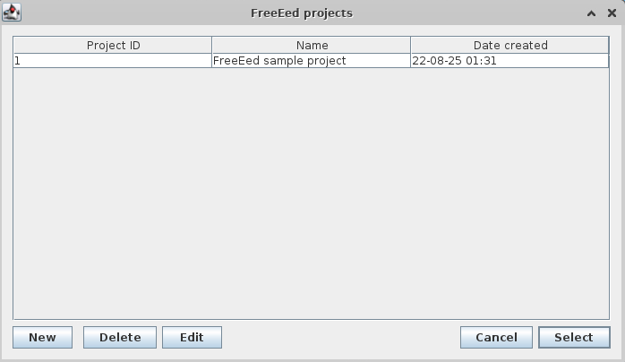

* You will see the main window with an included project. Click on "Select" to select this project.

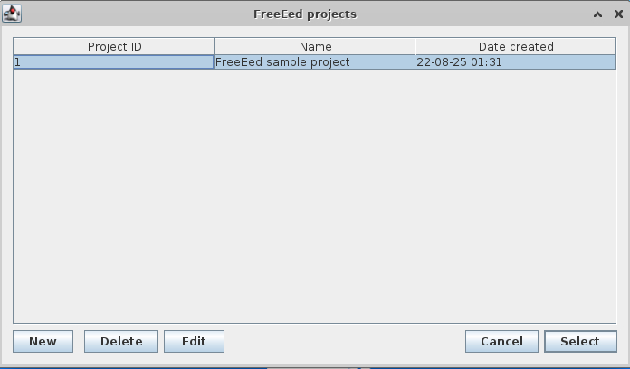

* Click "Edit" - "Project options"

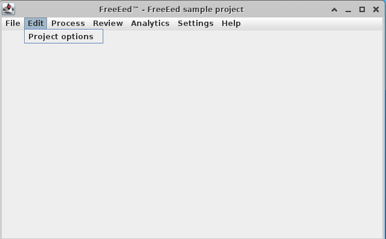


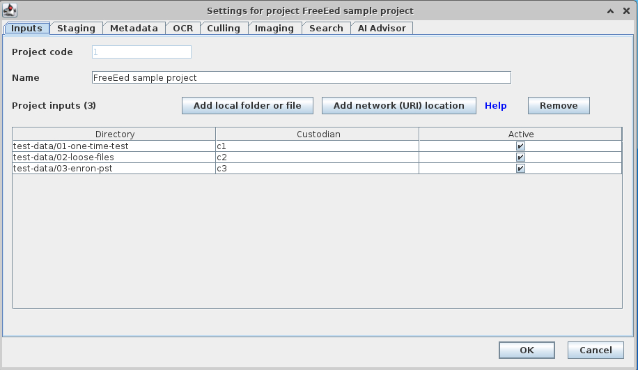

* In the "Project options" dialog, select the "Search" tab.

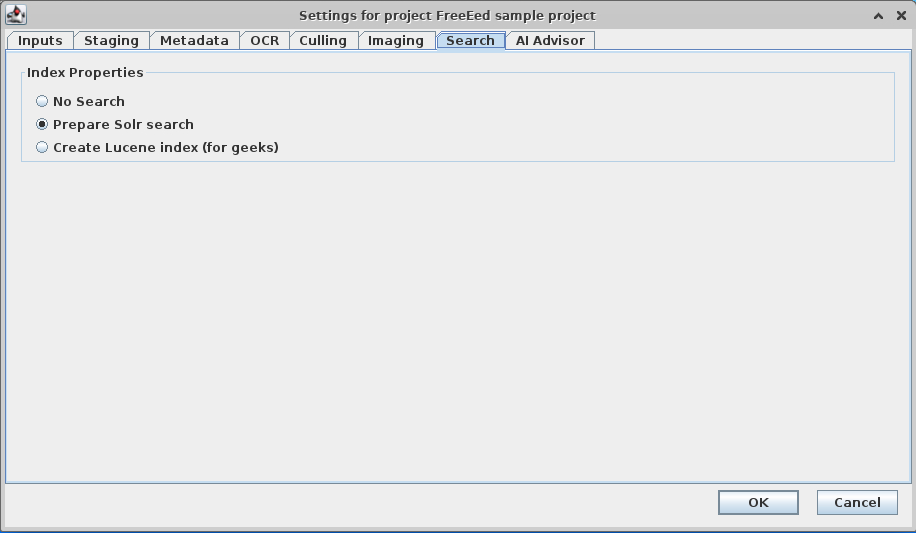

* Chose "Prepare SOLR search" and click "OK".

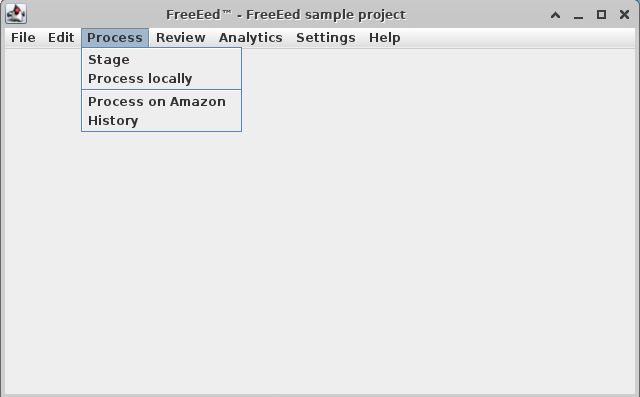

* Click "Process" - "Stage"

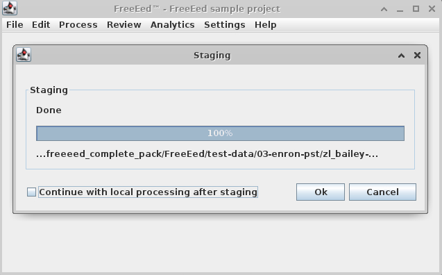

* Watch it stage, then click "OK" to close the dialog.

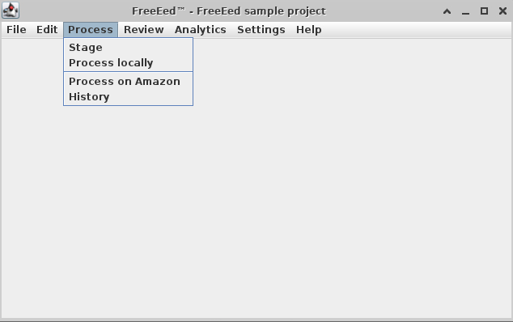

* Click "Process" - "Process locally". This will take a while. While, processing, it is sending data to the search engine.
* Watch it process locally, then click "OK" to close the dialog. Keep watching until the message in the log window stop.

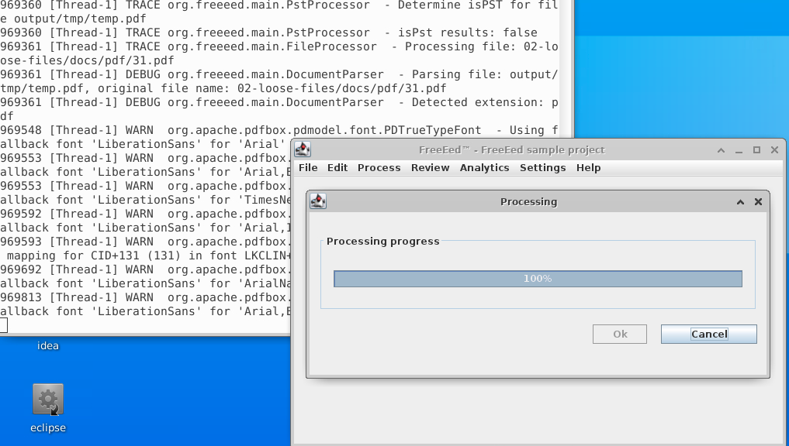

* Now chose "Review" - "Go to review"

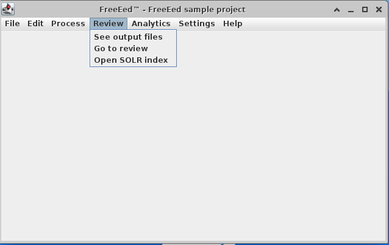

* You will see a browser window with the search engine. Log in with "admin" and "admin".

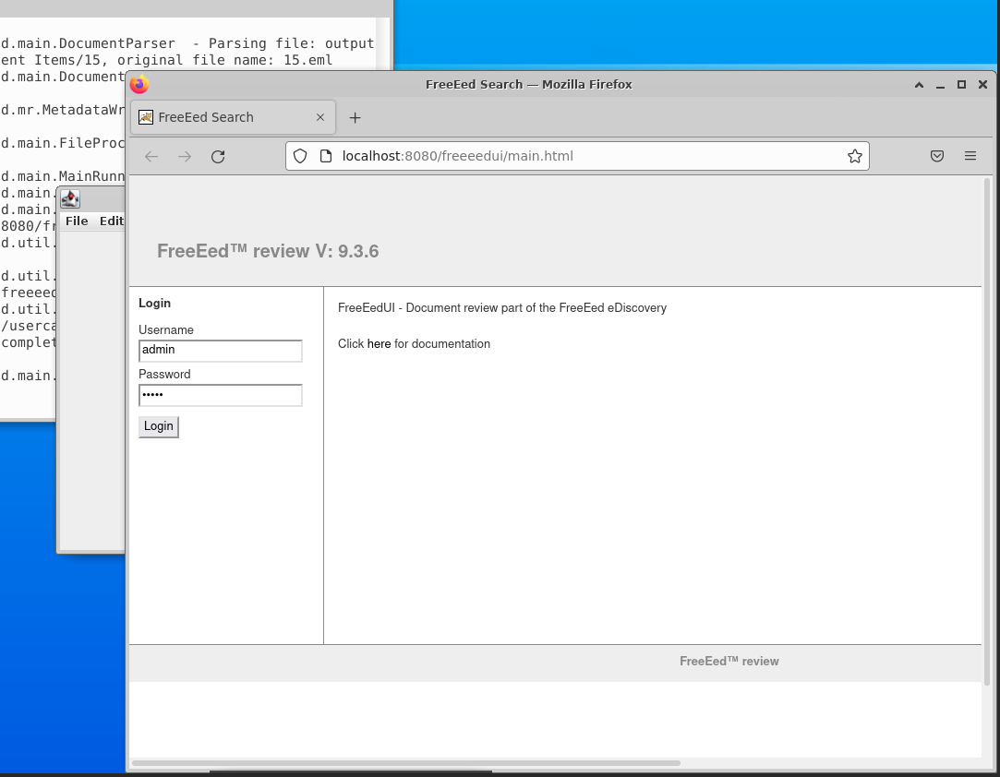

* Click "Search". You will see the search window.

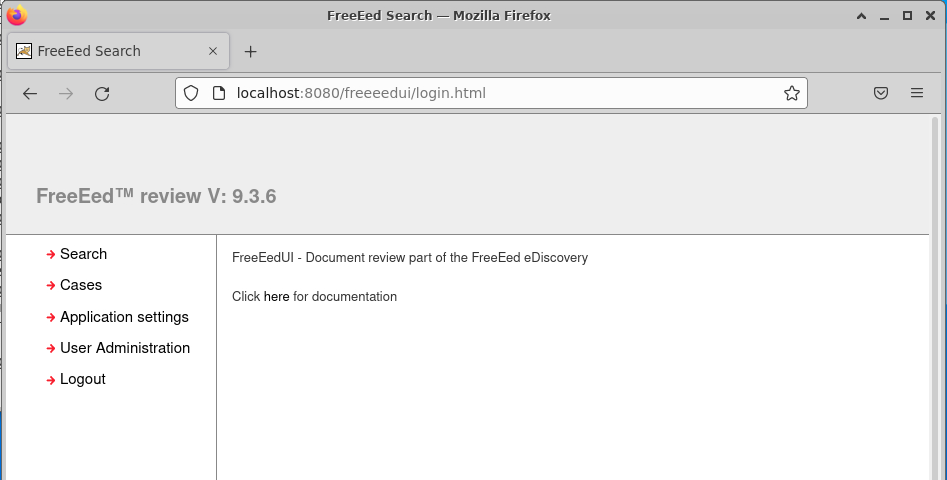

* Search in case "1".

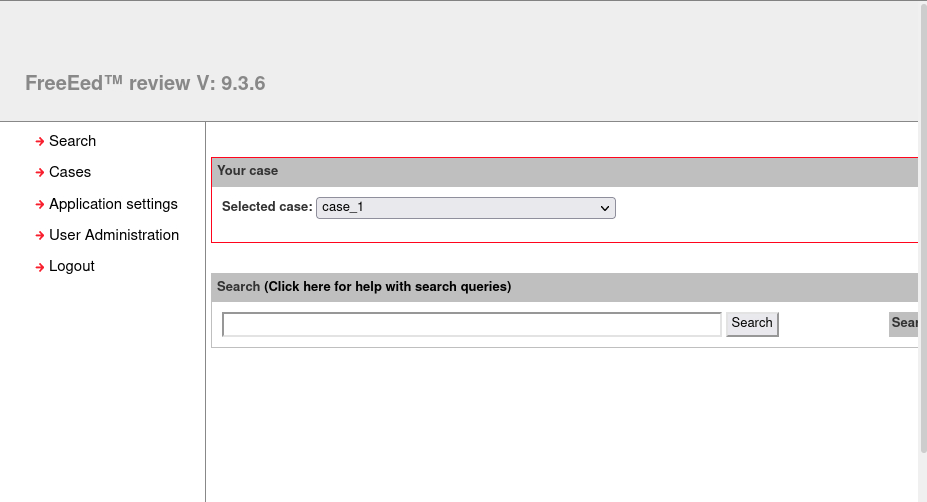

### STEP 3: Experiment with search


* Search start "*" brings back all documents
* Search on a keyword brings back all documents that contain the keyword

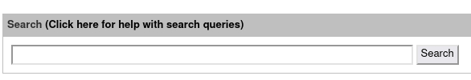

* Click on "Click here for help with search queries". You will be taken to a help page.

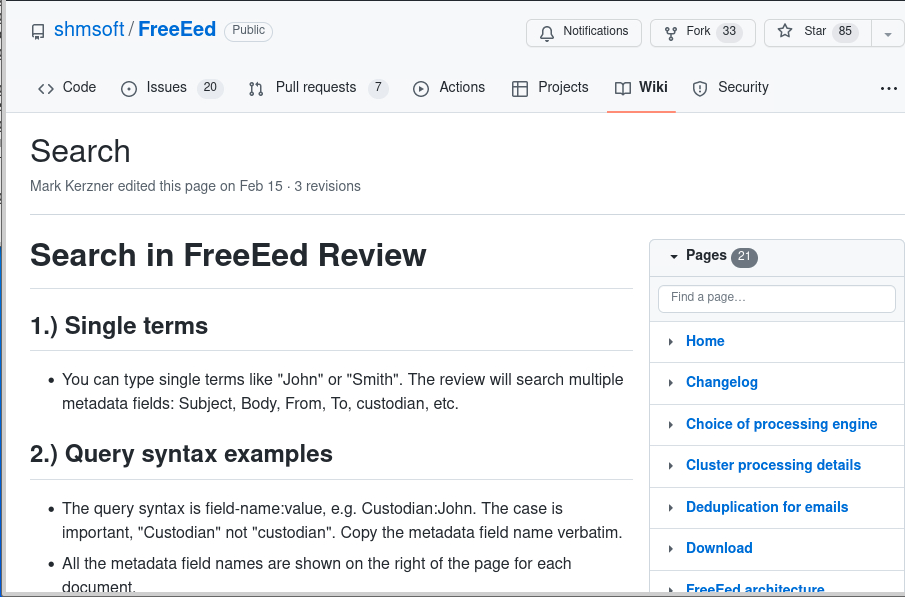

* Create a query for every one of the help items. You will have a total of 6 queries.

### Congratulations! You are done with FreeEed overview.

